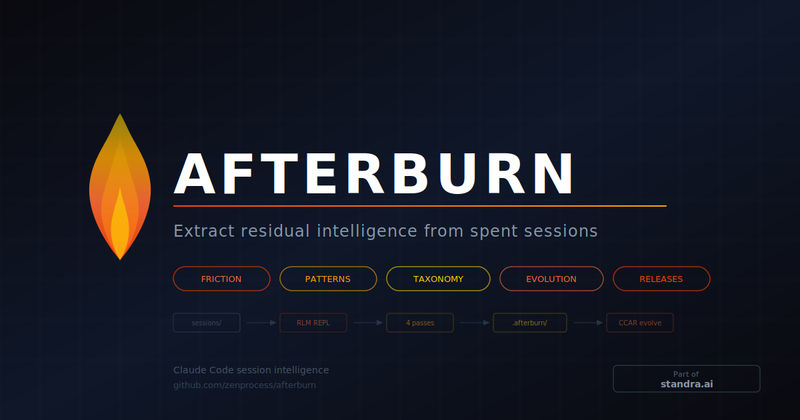

<p align="center">
  
</p>

```
     _    _____ _____ _____ ____  ____  _   _ ____  _   _
    / \  |  ___|_   _| ____|  _ \| __ )| | | |  _ \| \ | |
   / _ \ | |_    | | |  _| | |_) |  _ \| | | | |_) |  \| |
  / ___ \|  _|   | | | |___|  _ <| |_) | |_| |  _ <| |\  |
 /_/   \_\_|     |_| |_____|_| \_\____/ \___/|_| \_\_| \_|

 Extract residual intelligence from spent sessions.
```

Afterburn mines your [Claude Code](https://docs.anthropic.com/en/docs/claude-code) conversation history to find what keeps going wrong, what works well, and how to make your skills better — automatically.

```
$ afterburn discover

Scanning 120 sessions (1.5GB) from ~/.claude/projects/-home-user-myproject/...
Processing: ████████████████████████████░░░░ 89/120 sessions (156 LLM calls)

✓ Fix list:        .afterburn/fix-list.md         (23 recurring issues found)
✓ Pattern catalog: .afterburn/pattern-catalog.md   (12 successful patterns)
✓ Skill gaps:      .afterburn/skill-candidates/    (4 candidate skills)
```

## Architecture

```
 ~/.claude/projects/                          Your session transcripts
 ├── -home-user-project/                      (JSONL, one per conversation)
 │   ├── abc123.jsonl  (2.3MB)
 │   ├── def456.jsonl  (45MB)  ─── too big ──┐
 │   └── ghi789.jsonl  (800KB)               │
 │                                            │
 ▼                                            ▼
┌──────────────────────┐    ┌─────────────────────────────────┐
│  Direct Parse        │    │  RLM REPL Engine                │
│  (< 10MB sessions)   │    │  (>= 10MB sessions)             │
│                      │    │                                 │
│  Regex extraction:   │    │  1. Load JSONL into Python REPL │
│  • corrections       │    │  2. LLM writes code to filter   │
│  • tool denials      │    │  3. llm_query() on chunks       │
│  • error patterns    │    │  4. Aggregate → FINAL()         │
│  • confirmations     │    │                                 │
└──────────┬───────────┘    └──────────┬──────────────────────┘
           │                           │
           ▼                           ▼
     ┌─────────────────────────────────────┐
     │         Findings Engine             │
     │                                     │
     │  ┌───────────┐ ┌────────────────┐   │
     │  │ Friction  │ │ Patterns       │   │
     │  │ fix-list  │ │ pattern-catalog│   │
     │  └───────────┘ └────────────────┘   │
     │  ┌───────────┐ ┌────────────────┐   │
     │  │ Gaps      │ │ Provenance     │   │
     │  │ candidates│ │ metadata       │   │
     │  └───────────┘ └────────────────┘   │
     └──────────────────┬──────────────────┘
                        │
                        ▼
                  .afterburn/
                        │
              ┌─────────┼──── (optional) ────┐
              ▼                               ▼
     ┌────────────────┐            ┌──────────────────┐
     │  Archive       │            │  CCAR Evolve     │
     │  .tgz old      │            │  Experiment loop  │
     │  sessions      │            │  on SKILL.md      │
     │  clean history │            │  keep / discard   │
     └────────────────┘            └──────────────────┘
```

## What It Does

Every Claude Code session produces a full conversation transcript — your messages, Claude's responses, tool calls, errors, corrections, confirmations. These transcripts pile up in `~/.claude/projects/` and are never read again.

Afterburn reads them. It runs four analysis passes:

| Pass | Finds | Produces |
|------|-------|----------|
| **Friction** | Recurring errors, user corrections (classified by taxonomy), tool denials | `fix-list.md` with verification commands + remediation suggestions |
| **Patterns** | Approaches that consistently worked, user confirmations | `pattern-catalog.md` with draft CLAUDE.md rules |
| **Gaps** | Manual multi-step workflows repeated across sessions | `skill-candidates/` with draft SKILL.md files |
| **Releases** | Dead code shipped in version tags (new functions with zero callers) | Findings flagging unwired infrastructure per release |

### Correction Taxonomy

Friction corrections are sub-classified into 5 types with targeted remediations:

```
 Type       Example                          Remediation
 ─────────────────────────────────────────────────────────────
 process    "why did you push without        Add pre-commit hooks
             testing?"
 accuracy   "that's wrong, the port          Add verification steps
             is 8080"                         to CLAUDE.md
 scope      "I just wanted the function      Add scope constraints
             name"
 tooling    "use python3, not python"        Fix environment detection
 missing    "you forgot the import"          Add completion checklists
```

### Cross-Repo Session Correlation

Multi-agent dispatches create dozens of worktree sessions that are actually one orchestrated workflow. Afterburn groups child agent sessions under their parent:

```bash
# Analyze all repos under ~/orchestrator/
afterburn narrative --week --project-group /home/user/orchestrator

# Or specific repos
afterburn discover --projects sieeve,switchyard,zendev-lite
```

Then, optionally, it can **evolve** existing skills:

```
$ afterburn evolve --skill deploy --max-iterations 10

Evolving: deploy (baseline correction_rate: 0.34)
  #1 keep  → 0.31 (added retry guidance for hook failures)
  #2 keep  → 0.28 (removed ambiguous scope language)
  #3 discard → 0.35 (regressed, reverted)
  ...
  #8 keep  → 0.22 (best)

✓ Experiment branch: afterburn/deploy-1712179200
  Baseline: 0.34 → Best: 0.22 (35% improvement)
  8 iterations: 5 kept, 2 discarded, 1 crashed
```

## How It Works

### The Scale Problem

Your session files can be enormous — we've seen individual transcripts hit 93MB. No context window can hold that. Afterburn uses **RLM REPL** (Recursive Language Models) to solve this:

```
 93MB session file
 ┌─────────────────────────────────────────────────┐
 │ 45,000 messages                                 │
 │                                                 │
 │  Root LLM writes Python in the REPL:            │
 │  ┌───────────────────────────────────────────┐  │
 │  │ corrections = [m for m in context         │  │
 │  │   if m['role'] == 'user'                  │  │
 │  │   and len(m['content']) < 500]            │  │
 │  │ # 45,000 → 200 candidates                │  │
 │  │                                           │  │
 │  │ for batch in chunks(corrections, 20):     │  │
 │  │     result = llm_query(                   │  │
 │  │         f"Classify: {batch}")             │  │
 │  │     findings.extend(result)               │  │
 │  │                                           │  │
 │  │ FINAL_VAR('findings')                     │  │
 │  └───────────────────────────────────────────┘  │
 └─────────────────────────────────────────────────┘
                    │
                    ▼
         10 classified corrections
         with themes and evidence
```

### The Evolution Loop

Skill evolution uses **CCAR** (Claude Code AutoResearch) — an autonomous experiment loop:

1. **Baseline**: Compute a benchmark score from historical skill invocations
2. **Mutate**: Claude proposes a change to the SKILL.md based on failure analysis
3. **Benchmark**: Run the mutated skill against test cases from history
4. **Gate**: If improved → git commit. If regressed → git restore.
5. **Repeat**: Until max iterations or convergence

Everything stays on a git branch. Nothing touches your main branch until you review and merge.

## Install

### As a Python CLI

```bash
pip install afterburn
# or
pip install git+https://github.com/zenprocess/afterburn.git
```

### As Claude Code Slash Commands

```bash
afterburn install           # Install to current project's .claude/commands/
afterburn install --global  # Install to ~/.claude/commands/ (all projects)
```

Then in Claude Code:
```
/afterburn-discover              # Run all three passes
/afterburn-discover --pass friction --since 2026-03-01
/afterburn-evolve --skill deploy --max-iterations 5
/afterburn-status                # Show last run summary
```

## Usage

### Discover

```bash
# All three passes on the current project
afterburn discover

# Single pass
afterburn discover --pass friction
afterburn discover --pass patterns
afterburn discover --pass gaps

# Filter by date
afterburn discover --since 2026-03-01

# Filter by project
afterburn discover --project -home-user-myproject

# Custom session directory (e.g., from another machine)
afterburn discover --sessions-dir /mnt/mac-sessions/.claude/projects/

# JSON output for programmatic use
afterburn discover --format json

# Include worktree sessions (excluded by default)
afterburn discover --include-worktrees

# Limit LLM calls (default: 1000)
afterburn discover --max-calls 500
```

### Evolve

```bash
# Evolve a skill with CCAR experiment loop
afterburn evolve --skill deploy --max-iterations 10

# Dry run — show what would be benchmarked
afterburn evolve --skill deploy --dry-run

# Check experiment status
afterburn status
```

### Archive

```bash
# Archive sessions older than 7 days, clean history
afterburn archive

# Custom age threshold
afterburn archive --days 14

# Preview what would be archived
afterburn archive --dry-run
```

### Output

All outputs are written to `.afterburn/` in the current directory:

```
.afterburn/
├── fix-list.md              # Recurring issues with verification commands
├── pattern-catalog.md       # Successful patterns with draft rules
├── skill-candidates/        # Draft SKILL.md files for identified gaps
│   ├── candidate-001.md
│   └── candidate-002.md
├── state.json               # Incremental analysis state
├── errors.log               # Any processing errors
└── provenance.json          # What was analyzed, when, with what model
```

## Configuration

Afterburn auto-detects the best available LLM backend:

```
 Priority order:
 ┌─────────────────────────────────────────────┐
 │ 1. AFTERBURN_API_URL env var set?           │
 │    └─ Yes → Use OpenAI-compatible API       │──→  vLLM, Ollama, llama.cpp
 │                                             │
 │ 2. `claude` CLI available?                  │
 │    └─ Yes → Use claude -p --model haiku     │──→  Zero config, just works
 │                                             │
 │ 3. Fallback → localhost:8080/v1             │──→  Local model expected
 └─────────────────────────────────────────────┘
```

### Recommended: Local Model for Large Sessions

Session files can be tens of megabytes. Processing them through a cloud API works but sends large volumes of conversation data over the network. For privacy and speed, **we recommend a local model** via [Ollama](https://ollama.ai) or [vLLM](https://docs.vllm.ai):

```bash
# Ollama (easiest)
ollama pull qwen3:32b
AFTERBURN_API_URL=http://localhost:11434/v1 afterburn discover

# vLLM (fastest, needs GPU)
AFTERBURN_API_URL=http://localhost:8000/v1 afterburn discover
```

For smaller session sets or when privacy is not a concern, `claude -p` works with zero configuration — Afterburn auto-detects it.

### Environment Variables

```bash
# Point to your local model
AFTERBURN_API_URL=http://localhost:11434/v1    # Ollama
AFTERBURN_API_URL=http://localhost:8000/v1     # vLLM

# Or use Claude CLI (auto-detected, no env var needed)
# Just have `claude` in your PATH

# SSL bypass for self-signed certs
AFTERBURN_NO_SSL_VERIFY=1
```

### Backend Comparison

| Backend | Best for | Setup |
|---------|----------|-------|
| **Ollama** | Easy local setup, moderate sessions | `ollama pull qwen3:32b` |
| **vLLM + [qwen3-coder](https://servingcard.dev/model/qwen3-coder)** | Large sessions, GPU available, highest precision | Server with CUDA |
| **claude -p** | Small-to-medium sessions, zero config | Just have Claude Code installed |

## Benchmarks

Tested on a real 93MB session transcript (6,788 messages) from a production Claude Code project.

### Friction Pass — 93MB Session

```
 ┌─────────────────────────────────────────────────────────────────────┐
 │  Model            │ Iterations │  Time   │ Findings │   Quality    │
 ├───────────────────┼────────────┼─────────┼──────────┼──────────────┤
 │  qwen3-coder      │     22     │ 2m 15s  │    5     │  ★★★★★       │
 │  (vLLM, fp8)      │            │         │          │  High prec.  │
 ├───────────────────┼────────────┼─────────┼──────────┼──────────────┤
 │  Claude Haiku     │      2     │    34s  │    9     │  ★★★★☆       │
 │  (claude -p)      │            │         │          │  Some noise  │
 └───────────────────┴────────────┴─────────┴──────────┴──────────────┘
```

### Key Observations

**[qwen3-coder](https://servingcard.dev/model/qwen3-coder)** (80B MoE, fp8 via vLLM):
- 22 iterations: methodically inspected structure → filtered candidates → classified each
- 255K input tokens / 4.7K output tokens
- Every finding was a genuine user correction with full context
- Extracted precise themes: `wrong_approach`, `redirect`, `scope_creep`
- Best for: large session analysis where precision matters

**Claude Haiku** (`claude -p --model haiku`):
- 2 iterations: inspected structure → produced all findings in one shot
- Found 9 corrections vs qwen's 5 — higher recall
- Some false positives: session-continuation summaries misclassified as corrections
- Best for: fast analysis, smaller sessions, or when recall > precision

### Recommendation

```
 Session size        Recommended backend
 ──────────────────────────────────────────
 < 1MB               claude -p (instant)
 1-10MB              claude -p or Ollama
 10-100MB            vLLM + qwen3-coder
 > 100MB             vLLM + qwen3-coder
```

For the **two-model architecture** (best of both worlds), use Claude as root orchestrator and qwen3-coder for recursive chunk analysis:

```bash
# Root = Claude (fast, precise REPL protocol), Recursive = local qwen3-coder (cheap volume)
AFTERBURN_API_URL=http://localhost:8000/v1 afterburn discover
```

## Privacy

- **Read-only**: Session files are never modified
- **Redaction**: Outputs sanitize secrets (API keys, tokens, passwords) and truncate tool results to 200 chars
- **Local-first**: Runs against local models (vLLM, Ollama) with zero data leaving your machine
- **No telemetry**: Nothing phones home

## Requirements

- Python 3.10+
- `requests` (only pip dependency)
- `jq` (for CCAR experiment scripts)
- An LLM backend (see Configuration above)
- Linux or macOS

## How It Compares

| Tool | What it does | Difference |
|------|-------------|------------|
| Claude Code `/insights` | Built-in: generates an HTML report of your dev habits (satisfaction, friction, tool usage stats) over 30 days using Haiku | Afterburn goes deeper: mines cross-session patterns, proposes CLAUDE.md rules and new skills, and *evolves* existing skills via experiment loops. Complementary, not competing. |
| Claude Code `/compact` | Compresses current conversation | Afterburn analyzes *past* conversations |
| Claude Code auto-memory | Saves key facts per session | Afterburn finds patterns *across* sessions |
| DSPy optimizers | Optimize LLM prompts via Python framework | Afterburn is framework-free, uses CCAR loops |
| CCAR standalone | Autonomous experiment loop | Afterburn adds session mining as the input source |

## Acknowledgements

Afterburn builds on these open-source projects:

- **[CCAR](https://github.com/mitkox/ccar)** by Mitko — Claude Code AutoResearch experiment loop (MIT license)
- **[RLM](https://github.com/alexzhang13/rlm-minimal)** by Alex Zhang — Recursive Language Models reference implementation (MIT license), based on [arXiv:2512.24601](https://arxiv.org/abs/2512.24601) by Zhang, Kraska & Khattab

The skill evolution approach was inspired by [DSPy's GEPA optimizer](https://dspy.ai/api/optimizers/GEPA/overview/) (Stanford NLP) and [NousResearch's hermes-agent-self-evolution](https://github.com/NousResearch/hermes-agent-self-evolution).

Benchmarked with [qwen3-coder](https://servingcard.dev/model/qwen3-coder) via [ServingCard](https://servingcard.dev) — the model registry for optimized LLM serving configurations.

## License

MIT

---

<p align="center">
  <a href="https://standra.ai">
    
  </a>
</p>
